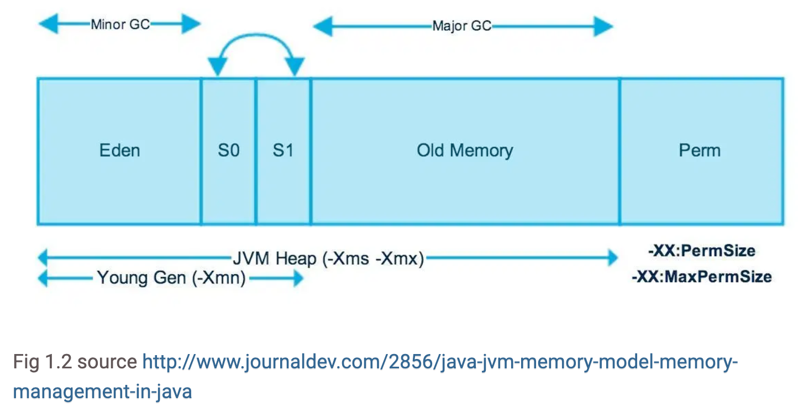

# [10분 테코톡] 👌던의 JVM의 Garbage Collector
## Garbage Collector
동적으로 할당한 메모리 영역 중 사용하지 않는 영역을 탐지하여 해제하는 기능

## GC의 장점
- 메모리 누수 방지
- 해제된 메모리에 접근 방지
- 해제한 메모리 재 해제 방지

## GC의 단점
- GC 작업은 순수 오버헤드
- 개발자는 언제 GC가 메모리를 헤재하는지 모름 (실시간 작업에는 GC가 맞지 않을 수 있음)

## 자바 내의 메모리 영역
### Stack : 정적으로 할당한 메모리 영역
- 원시 타입의 데이터가 값과 함께 할당, Heap영역에 생성된 Object 타입의 데이터의 참조 값 할당
### Heap : 동적으로 할당한 메모리 영역
- 모든 Object 타입의 데이터가 할당, Heap영역의 Object를 가리키는 참조 변수가 Stack에 할당

## Heap 영역 구조

### 1. New/Young
- 일단 메모리에 객체가 생성되면 Eden 영역에 객체가 지정된다.
- Eden 영역에 데이터가 가득 차면, Eden 영역에 있던 객체가 Survivor1 또는 Survivor2로 옮겨진다. 대부분의 JVM 메모리 구조를 설명하는 그림에서 1과2로 나누는데, 이 두 개의 영역 사이에 우선순위가 있는 것은 아니다. 단지 쉽게 설명하기 위헤 1과 2로 나눈다고 생각하면 된다.
- Eden 영역에서 Survivor1 또는 Survivor2로 옮겨지는 객체들은 어딘가에서 참조되고 있는 객체들이다. 둘 중 하나의 영역이 가득 차게 되면 공간이 남아있는 Survivor로 이동하게 된다.
- 이러한 매커니즘 때문에 Survivor1 또는 Survivor2 둘 중 하나는 항상 비워있는 공간이 있는 채로 유지된다.
- 이러한 과정에서 1차 GC라고 불리는 Minor GC가 발생한다. Minor GC는 New/Young 영역에서 발생하는 GC로 Eden영역 또는 Survivor1 또는 Survivor2에서 사용되지 않는 객체들을 삭제한다.
### 2. Old
- Survivor1 / Survivor2를 왔다 갔다 하는 과정에서 오랫동안 살아남은 객체들은 Old 영역으로 이동한다. 보통 Old 영역은 Young 영역보다 크게 할당하며, 이러한 이유로 Old 영역의 GC는 Young 영역보다 적게 발생한다.
- 단, Young 영역에서 Old 영역으로 넘어가는 객체 중, Survivor 영역을 거치지 않고 Eden 영역에서 바로 Old 영역으로 넘어가는 객체도 존재하는데, 이는 객체의 크기가 아주 클 경우 발생한다. 예를들어 Survivor영역의 크기가 16MB인데 객체의 크기가 20MB일 경우에 해당한다.

## GC 프로세스 (Mark and Sweep)
1. GC가 Stack의 모든 변수를 스캔하면서 각각 어떤 객체를 참조하고 있는지 찾아서 마킹한다.
2. Reachable Object가 참조하고 있는 객체도 찾아서 마킹한다.
3. 마킹되지 않은 객체를 Heap에서 제거한다.