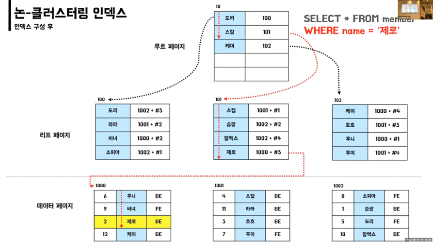
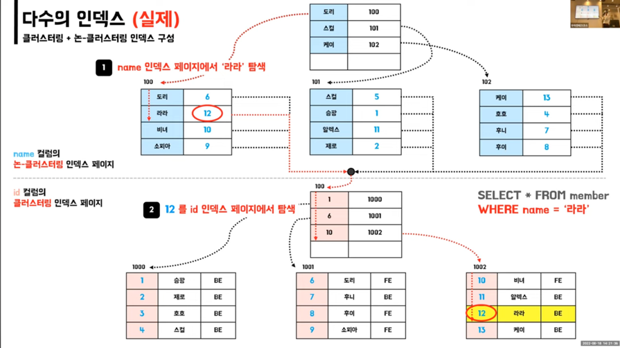

# [10분 테코톡] 라라, 제로의 데이터베이스 인덱스

## 데이터 베이스 인덱스란?
- 데이터의 순서를 특정 기준을 정렬하여 데이터 조회속도를 늘려주는 것
- 특정 컬럼을 인덱스 설정 한 다음 where절을 통해 검색을 한다.

## 인덱스 알고리즘
### Full Table Scan
- 순차적으로 접근
- 적용 가능한 인덱스가 없는 경우에 사용
- 인덱스 처리 범위가 넓은 경우에 사용
- 크기가 작은 테이블에 엑세스하는 경우에 사용

### B-Tree(Balanvced-Tree)
- 트리 높이가 같음
- 자식 노드를 2개 이상 가질 수 있음
- 기본 데이터베이스 인덱스 구조

### INSERT로 인한 페이지 분할
- 비어 있는 페이지 확보
- 문제가 있는 페이지의 데이터를 공평하게 나누어 저장
- 디비 속도에 영향을 줌

> DELETE는 기존값을 삭제하지 않고 사용안함으로 표시
> UPDATE는 DELETE와 INSERT 혼합

## 인덱스 종류
### 클러스터링 인덱스
- 실제 데이터와 같은 무리의 인덱스
- ex)사전처럼 정렬되어 있음

### 클러스터링 인덱스의 특징

- 실제 데이터 자체가 정렬
- 테이블당 1개만 존재 가능
- 리프 페이지가 데이터 페이지
- 아래의 제약조건 시 자동 생성
    - primary key(우선순위)
    - unique + not null

### 논클러스터링 인덱스
- 실제 데이터와 다른 무리의 별도의 인덱스
- ex)목차처럼 별도의 페이지가 존재

### 논클러스터링 인덱스의 특징

- 실제 데이터 페이지는 그대로
- 별도의 인덱스 페이지 생성 -> 추가 공간 필요
- 테이블당 여러 개 존재
- 리프 페이지에 실제 데이터 페이지 주소를 담고 있음
- unique 제약조건 적용시 자동 생성
- 직접 index 생성시 논클러스터링 인덱스 생성

### 다수의 인덱스 

- 리프 페이지에 실제 데이터 페이지 주소x
- 리프 페이지에 클러스터링 인덱스가 적용된 컬럼의 실제 값O

## 인덱스 적용 기준
- 카디널리티가 높은 것 (중복이 적은 것)
- WHERE,JOIN,ORDER BY 절에 자주 사용되는 컬럼
- INSERT/UPDATE/DELETE가 자주 발생하지 않는 컬럼
- 규모가 작지 않은 테이블