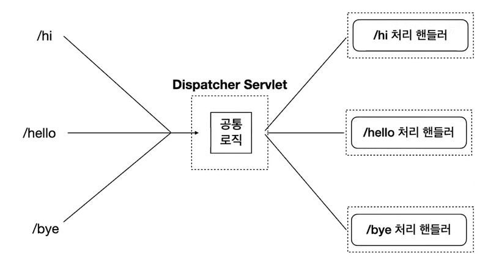

# [10분 테코톡] 🐶 코기의 Servlet vs Spring
## 서블릿이란
- Dynamic Web Page를 만들 때 사용되는 자바 기반의 웹 애플리케이션 프로그래밍 기술
- 웹 요청과 응답의 흐름을 간단한 메서드 호출만으로 체계적으로 다룰 수 있게 해주는 기술

## 서블릿의 특징
- 클라이언트의 Request에 대해 동적으로 작동하는 웹 애플리케이션 컴포넌트
- HTML을 사용하여 Response 한다.
- JAVA의 스레드를 이용하여 동작한다.
- MVC 패턴에서의 컨트롤러로 이용된다.
- HTTP 프로토콜 서비스를 지원하는 javax.servlet.http.HttpServlet 클래스를 상속받는다.
- UDP보다 속도가 느리다.
- HTML 변경 시 Servlet을 재 컴파일해야 하는 단점이 있다

## 서블릿 컨테이너 동작 방식
1. 사용자가 URL을 클릭하면 HTTP Request를 Servlet Container에 보낸다.
2. Servlet Container는 HttpServletRequest, HttpServletResponse 두 객체를 생성한다.
3. 사용자가 요청한 URL을 분석하여 어느 서블릿에 대한 요청인지 찾는다.
4. 컨테이너는 서블릿 service() 메소드를 호출하며, POST/GET 여부에 따라 doGet() 또는 doPost()가 호출된다.
5. doGet() 이나 doPost() 메소드는 동적인 페이지를 생성한 후 HttpServletResponse 객체에 응답을 보낸다.
6. 응답이 완료되면 HttpServletRequest, HttpServletResponse 두 객체를 소멸시킨다.

## 프론트 컨트롤러 패턴

- 스프링은 프론트 컨트롤러 패턴을 따르고 이를 DispatcherServlet이 담당한다.
- DispatcherServlet은 클라이언트의 요청을 먼저 받아 필요한 처리를 한 뒤, 개발자가 구현한 요청에 맞는 핸들러에게 요청을 Dispatch하고 해당 핸들러의 실행 결과를 Response형태로 만드는 역할을 한다.

## 서블릿의 라이프사이클
- 먼저, 앞에서 설명한 과정에 의해서, 브라우저의 요청을 받은 웹 서버가 전달받음
- 웹 서버는 서블릿을 서블릿 컨테이너에 전달
- 서블릿 컨테이너는 스레드에 대해서 스레드가 기동되면서 서블릿 객체를 생성
- 서블릿 객체가 생성된 후 , init() 메서드가 최초 한번만 생성된다
- 서블릿 객체는 메모리에 속해있어서, 요청될때마다, 서비스를 제공하는 요청 메서드인 doGet 혹은 doPost가 호출된다(그 이후는 위의 6~8 단계가 알맞게 작동됨)
- 하지만, 만약 톰캣을 해제 or 서블릿 컨테이너 종료(톰캣 재가동) or 서블릿 내용 변경이 발생한다면 , 자원을 해제하는 destroy()가 호출됨