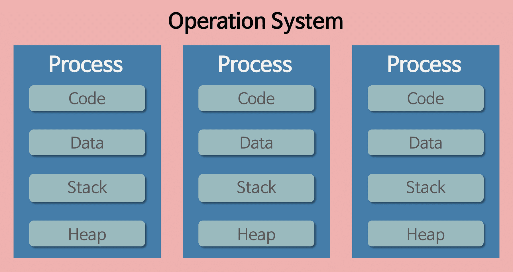
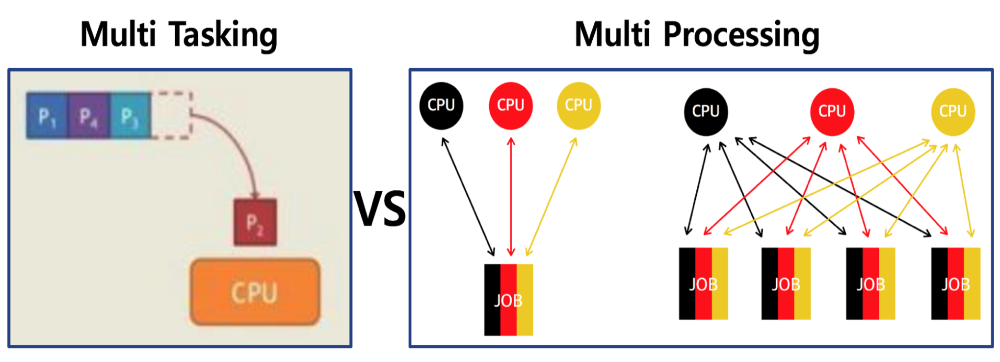
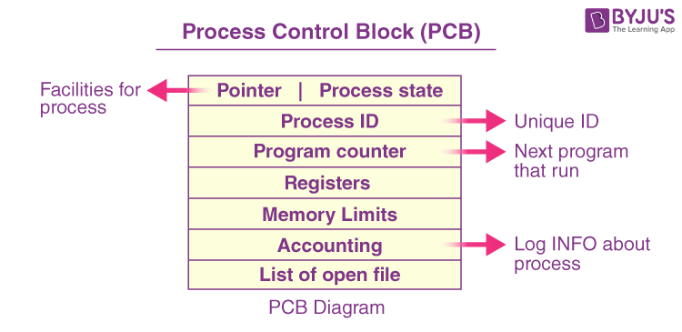
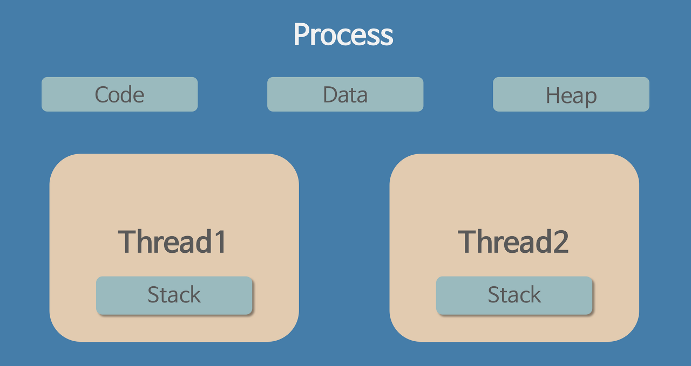

# 프로그램

파일이 저장장치에 저장되어 있지만 메모리에는 올라와 있지 않은 정적인 상태,

어떠한 **작업을 위해 실행할 수 있는 파일**을 뜻합니다.

# 프로세스

프로그램이 **컴퓨터 메모리(RAM)에 적재되어 실행 중인 상태**를 뜻합니다.

운영체제로부터 **자원을 할당받는 작업의 단위**이며 **운영체제가 시스템 자원을 관리하는 최소 단위**입니다.

프로세스는 운영체제로부터 작업 시간과 메모리를 할당 받습니다. 할당 받은 메모리는 다시 Code, Data, Stack, Heap영역으로 나누어 사용합니다.

- Code : 프로그래머가 작성한 프로그램, 즉 코드가 적재되는 공간 (정적 영역)
- Data : 코드가 실행되면서 사용한 변수나 각종 파일의 데이터가 저장되는 공간 (정적 영역)
- Stack : 함수의 수행을 마치고 복귀할 주소 및 데이터(지역변수, 매개변수, 리턴 값)등을 임시로 저장하는 공간 (동적 영역)
- Heap : 동적으로 할당되는 데이터들을 위해 존재하는 공간 (동적 영역)

# 멀티 프로세스

하나의 프로그램을 여러 프로세스로 구성해 각 프로세스가 독립적으로 하나의 작업을 처리하는 것을 멀티 프로세스라고 합니다.

멀티 프로세스를 수행하는 방법으로는 멀티 태스킹과 멀티 프로세싱이 있습니다.

## 멀티 태스킹과 멀티 프로세싱

### 멀티 태스킹

**하나의 코어**에서 **둘 이상의 프로세스를 동시에 실행기키는 것 처럼 보이는 작업 방식**입니다.

코어란 CPU 내에 작업을 수행하는 주체를 뜻합니다. 코어는 멀티 태스킹을 수행하기 위해 여러 프로세스들을 빠르게 교체해 가며 수행합니다. (동시성)

분신술?!?!

### 멀티 프로세싱

멀티 프로세싱이란 **둘 이상의 코어**가 **병렬적으로 여러 프로세스를 수행하는 방식**입니다. 둘 이상의 코어에서 프로세스를 동시에 실행할 수 있지만, 하나의 코어에서도 여러 프로세스를 실행할 수 있겠죠?

### PCB와 Context Switching

코어는 시스템의 효율성을 위해 여러 프로세스들을 빠르게 교체해 가며 사용한다고 했죠?

CPU의 입장에선 프로세스 교체 후 작업을 다시 진행하기 위해서 프로세스가 현재 어떠한 상태인지, 어떠한 정보를 가지고 있는지, 어느 위치의 메모리에 적재되어 있는지 알아야 할 필요가 있습니다.

운영체제는 프로세스 생성과 동시에 이러한 정보들을 특정한 자료구조로 묶어 관리하는데 이를 PCB라고 합니다.

PCU는 프로세스 교체 시 해당 프로세스의 PCB에 상태를 저장, 프로세스 교체 후 다시 PCB를 통해 프로세스의 정보를 읽어 들이는데 이러한 일련의 과정을 Context Switching이라고 합니다.

기본적으로 Context Switching이 발생하면 이 영역을 모두 내리고 실행하고자 하는 프로세스의 code, data, stack, heap를 다시 불러와야 합니다. 때문에  Context Switching이 많아지면 CPU에 걸리는 부담(오버헤드)도 많아지게 됩니다.

이러한 비효율을 줄이고자 등장한 것이 스레드입니다.

# 스레드

스레드란 프로세스 내에서 실행되는 작업 흐름의 단위입니다. 하나의 프로세스는 반드시 하나 이상의 스레드를 가지게 되는데 이를 main 스레드라고 합니다.

스레드는 프로세스내에서 Code, Data, Heap 영역을 공유하며, Stack영역은 따로 가지고 있습니다.

# 멀티 스레드

프로세스 내에 여러 스레드를 가지고 있는 것을 멀티 스레드라고 합니다. 프로그램의 효율성을 높이기 위해 멀티 태스킹처럼 하나의 프로세스 내의 여러 스레드를 교체해 가며 동시적으로 여러 스레드들의 작업을 수행하는 것이죠.

- Context Switching 시 Stack 영역만 교체하면 되기 때문에 Context Switching에 대한 부담이 비교적 적다.
- 프로세스 내의 메모리와 데이터를 공유하고 있기 때문에 응답이 빠르고 메모리를 아낄 수 있다.
- 단, 메모리를 공유하기 때문에 동기화 처리를 하지 않으면 동기화 문제가 발생한다.
- 어디 까지나 하나의 프로세스 내에서 실행되는 것이기 때문에 스레드 하나가 오류를 일으키면 프로세스 전체에 영향을 미친다.